# Django Básico

## Configurações iniciais

1. **Instalando python**
    
    * Adota-se por padrão a versão 3.7.7 do python no projetos do NTI. A versão pode ser baixada no [Site Oficial](https://www.python.org/downloads/release/python-377/), ou clicando diretamente [aqui](https://www.python.org/ftp/python/3.7.7/python-3.7.7-amd64.exe) caso esteja utilizando SO windows.
    * Obs. Lembre-se de associar a versão ao path durante o processo de instalação:

        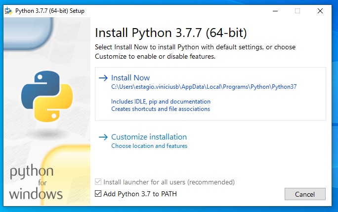
        
    * Observe-se que um sistema pode possuir mais de uma versão instalada. Para verificar a versão associada ao path, pode-se utilizar o comando no prompt:
    
        ```scrit
            > python --version
        ```
    * A versão será exibida abaixo:
    
        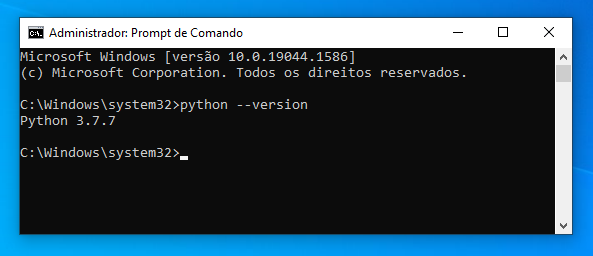
    
1. **Instalando PyCharm**

    * Sugere-se a utilização do PYCHARM como IDE de trabalho. A versão mais recente pode pode ser baixada no [Site Oficial](https://www.jetbrains.com/pt-br/pycharm/download/#section=windows), ou clicando diretamente [aqui](https://www.jetbrains.com/pt-br/pycharm/download/download-thanks.html?platform=windows&code=PCC) caso esteja utilizando SO windows.
    * Siga o instalador proguindo sempre com as opções padrão já selecionadas.
    * Observe que há duas versões do PyCharm, uma gratuita (community) e ou paga (professional), para a qual deve ser adquirida licença.
    
1. **Criando e ativando um ambiente virtual python**

    * Aplicações em Python normalmente usam pacotes e módulos que não vêm como parte da instalação padrão. Aplicações às vezes necessitam uma versão específica de uma biblioteca, porque ela requer que algum problema em particular tenha sido consertado ou foi escrita utilizando-se de uma versão obsoleta da interface da biblioteca.
    * Isso significa que talvez não seja possível que uma instalação Python preencha os requisitos de qualquer aplicação. Se uma aplicação A necessita a versão 1.0 de um módulo particular mas a aplicação B necessita a versão 2.0, os requisitos entrarão em conflito e instalar qualquer uma das duas versões 1.0 ou 2.0 fará com que uma das aplicações não consiga executar.
    * A solução para este problema é criar um ambiente virtual, uma árvore de diretórios que contém uma instalação Python para uma versão particular do Python, além de uma série de pacotes adicionais.
    * A criação de um ambiente virtual python pressupõe logicamente a instalação prévia do python, vez que a aplicação pip é instalada juntamente com o python por padrão. A verificação da versão do pip instalada pode ser feita através do comando (prompt):

        ```
            > pip --version
        ```

    * A versão será exibida abaixo:
    
        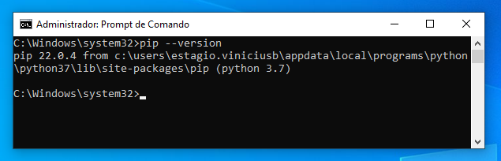
    
    * Um ambiente virtual python pode ser criado em qualquer diretório da máquina. No entanto sugere-se a sua criação em diretório distinto daquele destinado ao projeto.
    * Cria-se o ambiente virtual, no SO Windows, através do comando (prompt):
    
        ``` prompt
            > pythom -m venv <caminho absoluto (ou relativo) do direitório a ser criado>
        ```
    
    * O comando cria o diretório do ambiente virtual python, colocando os componentes necessários dentro. Veja o exemplo abaixo da criação do ambiente "ambVirt1":

        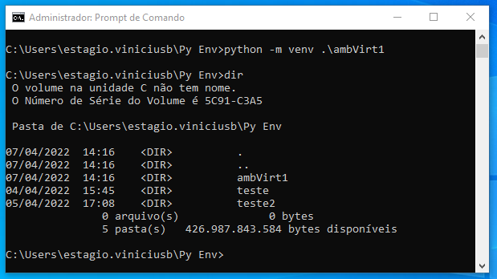
    
    * Pode-se criar um ambiente virtual a partir da ferramenta VIRTUALENV. Sua instalação é realizada a partir do comando:

        ``` powershell
            > pip install virtualenv
        ```

        A consulta da versão pode ser realizada a partir do comando:

        ``` powershell
            > virtualenv --version
        ```

    * Cria-se um ambiente virtual no diretório atual com a ferramenta virtualenv a partir do comando (prompt):

        ``` powershell
            > virtualenv <nome-do-ambiente>
        ```

        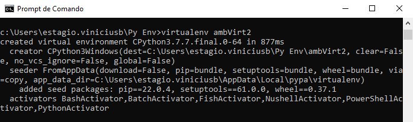

    * Obs.: O pycharm faz a criação automática do ambiente do projeto nos casos dos novos projetos. Solicitanto apenas que o usuário informe o interpretador base para o projeto (preferencialmente 3.7.7).

        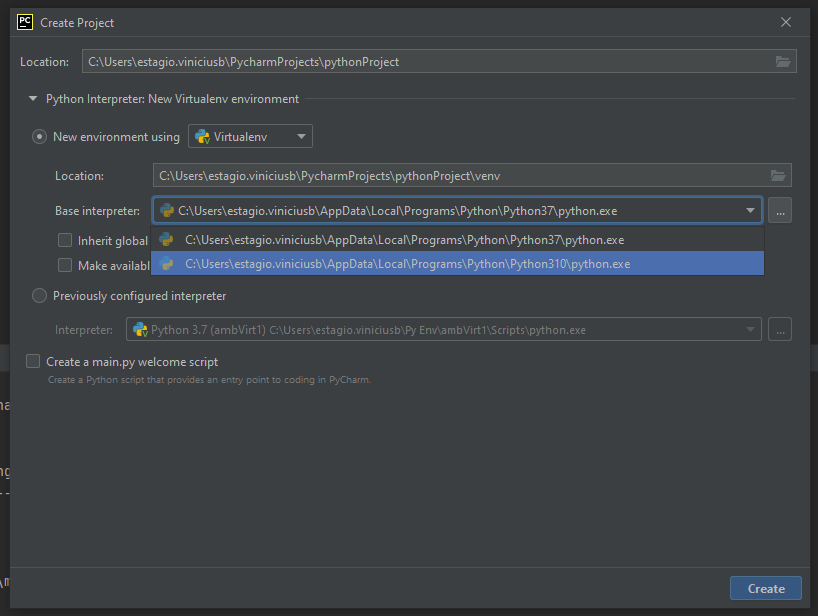

    * A ativação do ambiente pode ser feita a partir do próprio terminal do pycharm, via prompt ou powershell. Usualmente, o terminal do pycharm abre o prompt de comando do Windows já utilizando o ambiente ativado, caso o projeto tenha sido criado a partir da opção de novo ambiente virtual assinalada. Isso pode ser verificado a partir da própria indicação na linha de comando.

        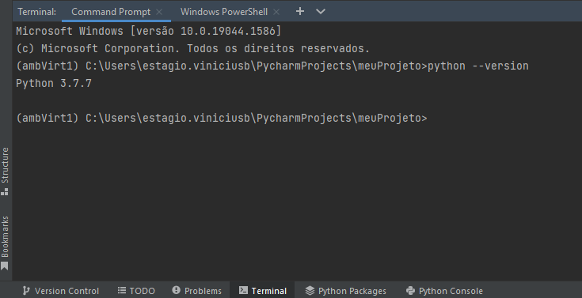

    * Caso não o ambiente não esteja ativado, a ativação pode ser feita manualmente executando-se o script "activate" no diretório "Scripts" contido no diretório do ambiente a ser utilizado.

        * Para *prompt* de comando:

            ``` command prompt
                (...)\<nome-do-ambiente>\Scripts> activate 
            ```

        * Para *powerShell*:

            ``` powershell
                (...)\<nome-do-ambiente>\Scripts> activate.ps1 
            ```
        
        * O *powerShell* pode apresentar uma mensagem de erro referente a impossibilidade de execução de scripts. Para solucionar o problema, altere a política de execução de script ao powerShell através do comando abaixo:
        
            ``` powershell
                > Set-ExecutionPolicy Unrestricted
                > S
            ```

            Em seguida realize a ativação pelo comando:

            ``` powershell
                (...)\<nome-do-ambiente>\Scripts> activate.ps1 
            ```
        
1. **Instalando Django**

    * Para instalar uma versão oficial específica (no caso a versão 3.2.9 adotada pelo NTI) do Django no diretório do projeto, utilize o seguinte comando (prompt) a partir do terminal do pycharm:

        ``` powershell
            (...)\> python -m pip install Django==3.2.9
        ```
    
    * Observa-se a finalização da instalação dos componentes:

        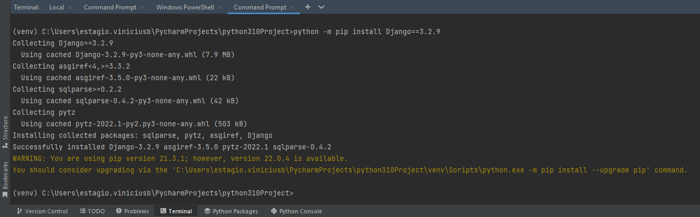

    * Pode-se observar as bibliotecas instaladas no ambiente a partir do comando (prompt):

        ``` powershell
            (...)\> pip freeze
        ```

    * Sendo exibidas como abaixo:

        

    * Obs. Aconselha-se redirecionar a saida do comando freeze para um arquivo de requiments.txt:

        ``` powershell
            (...)\> pip freeze > requiriments.txt
        ```
1. **Criando um projeto Django

    * Utilize o comando abaixo para criar o projeto Django dentro do diretório do projeto:

        ``` powershell
            (...)\> django-admin startproject <nome-do-projeto> .
        ```
    
    * Observe que a ferramenta cria os diretórios referentes ao projeto Django:

        

1. **Criando uma aplicação Django**
    
    * Utilize o comando abaixo para criar uma aplicação Django dentro do diretório do projeto:

        ``` powershell
            (...)\> django-admin startapp <nome-da-app>
        ```
    
    * Observe que a ferramenta cria os diretórios referentes a aplicação Django (foi utilizado o nome 'core' para aplicação):

        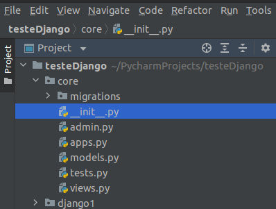

    * Dentro do diretório do **projeto Django** (não no diretório da APP), faça a inclusão da aplicação no arquivo "settings.py" em "INSTALLED_APPS". Também acrescente a lista de "TEMPLATES" o diretório "templates".

        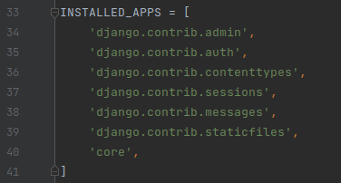
    
    
        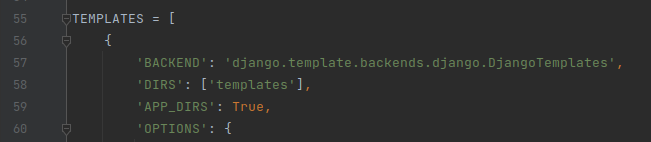
    
1. Projetos vs. Aplicações Django

    * O Django abrange um projeto, que representa todo o escopo, e aplicações, responsáveis pelas tarefas específicas.

1. Padrão MTV do Django

    * MVT significa Model-View-Template. Às vezes também é referido como MTV (Model-Template-View). MVT é um padrão de design ou arquitetura de design que o Django segue para desenvolver aplicações web. É um pouco diferente do padrão de design MVC (Model-View-Controller) comumente conhecido.
    * O 'Model' gerencia os dados e é representado por um banco de dados. O 'model' é basicamente uma tabela de banco de dados.
    * A 'View' recebe solicitações HTTP e envia respostas HTTP. A 'view' interage com um modelo e um template para concluir uma resposta.
    * O 'Template' é basicamente a camada front-end e o componente HTML dinâmico de uma aplicação Django.

    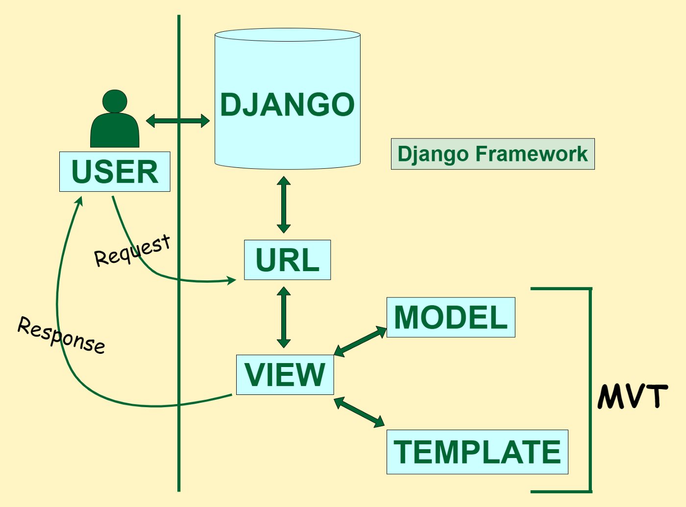
    
1. Configurações do Django e arquivo 'settings.py'

    * Importante: sempre que for utilizar os comandos de gerenciamento dos projetos Django certifique-se de executá-los no mesmo diretório do arquivo 'manage.py'. Para isso, verifique no terminal pycharm:
        
        no linux:
        
        ``` powershell
            (...)\> ls
        ```

        ou no windows:

        ``` powershell
            (...)\> dir
        ```
        
        Como resultado deverão ser informados os arquivos e diretórios contindos no diretório atual, devendo estar incluído entre eles o arquivo 'manage.py'.

    * Inicializando o servidor:
    
    ``` powershell
        (...)\> python3 manage.py runserver
    ```
    
    ``` powershell
        (...)\> python manage.py runserver
    ```
        
    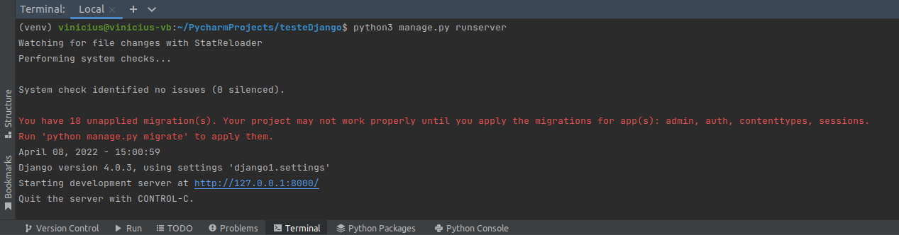
    
        * obs. para encerrar o servidor aperte <control+c>
    
    * No arquivo 'settings.py' dentro do projeto Django criado, é possivel fazer as configurações de ligua (alteração de en-us para pt-br), permissõe de host e debug:

    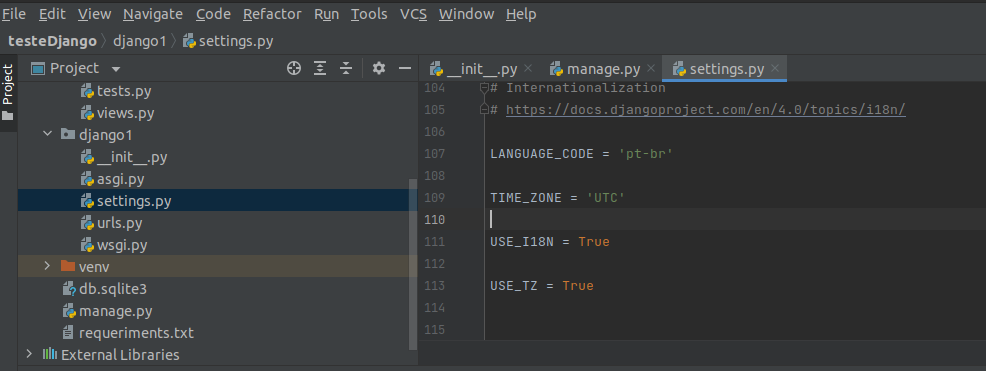
    
    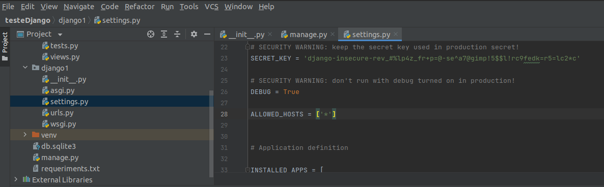
    
    * Observe que ao cliclar no endereço fornecido (geralmente loopback), será exibida a seguinte página (já em sua versão traduzida, caso tenha sido feita a alteração acima):

    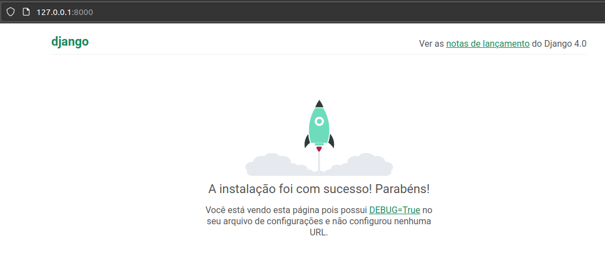
    
